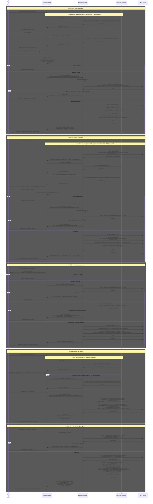

# Gestión de Planogramas

Cubre la creación, edición, archivado, listado y consulta de detalle de planogramas, con integración a la jerarquía de categorías vía CATI.

```mermaid
sequenceDiagram
    actor Analista
    participant FE as Frontend (React)
    participant API as Backend (Node.js)
    participant CATI as CATI (API.Catalogo)
    participant DB as SQL Server

    %% ─── NOTA DE ARQUITECTURA ──────────────────────────────────────────────────
    %% Backend Node.js tiene dos responsabilidades:
    %%   1. Proxy/middleware hacia CATI  →  auth interna via POST /api/Auth/exchange
    %%      { tokenCemacoAllInOne } → JWT Bearer. El frontend nunca llama CATI directo.
    %%      Endpoints de jerarquía usados en este CU:
    %%        GET /api/Jerarquia/Area
    %%        GET /api/Jerarquia/Departamento?area={id}&profile=CEMACO
    %%        GET /api/Jerarquia/Subcategoria?categoria={id}&profile=CEMACO
    %%      Respuesta Jerarquia: { id, name, department }
    %%   2. CRUD directo en SQL Server para el modelo de datos de planogramas.
    %% ────────────────────────────────────────────────────────────────────────────

    %% ════════════════════════════════════════════════════════
    %% CU-01-01 — Crear planograma
    %% ════════════════════════════════════════════════════════

    rect rgba(89, 89, 89, 1)
        Note over Analista,DB: CU-01-01 — Crear planograma

        Analista->>FE: Abre formulario nuevo planograma

        Note over FE,CATI: Carga jerarquía para el formulario — cascada Area → Departamento
        FE->>API: GET /api/jerarquia/areas
        API->>CATI: GET /api/Jerarquia/Area  [Bearer — token obtenido via /api/Auth/exchange]
        CATI-->>API: [ { id, name }, ... ]
        API-->>FE: 200 OK [ { id, name }, ... ]
        FE-->>Analista: Muestra dropdown de Áreas

        Analista->>FE: Selecciona Área
        FE->>API: GET /api/jerarquia/departamentos?area={areaId}
        API->>CATI: GET /api/Jerarquia/Departamento?area={areaId}&profile=CEMACO
        CATI-->>API: [ { id, name, department }, ... ]
        API-->>FE: 200 OK [ { id, name }, ... ]
        FE-->>Analista: Muestra dropdown de Departamentos

        Analista->>FE: Ingresa nombre del planograma<br/>y escribe subcategorías de referencia (texto libre)[]
        Analista->>FE: Envía formulario

        FE->>FE: Validación local<br/>· nombre requerido, máx. 100 chars<br/>· área y departamento requeridos<br/>· mínimo 1 subcategoría

        alt Validación local fallida
            FE-->>Analista: Muestra errores en campos
        else Validación exitosa
            FE->>API: POST /api/planogramas<br/>Body: { nombre, area, departamento, subcategorias: string[] }

            API->>API: Verifica token de sesión
            API->>DB: SELECT COUNT(*) FROM Planograma<br/>WHERE nombre = @nombre AND departamento = @departamento
            DB-->>API: count

            alt Nombre duplicado en el mismo departamento
                API-->>FE: 409 Conflict<br/>{ error: "Ya existe un planograma con ese nombre en el departamento" }
                FE-->>Analista: Muestra error de nombre duplicado
            else Nombre disponible
                API->>DB: BEGIN TRANSACTION
                API->>DB: INSERT INTO Planograma<br/>(nombre, departamento, estado='borrador',<br/>created_at=NOW(), created_by=@userId)
                DB-->>API: id (nuevo planograma)
                API->>DB: INSERT INTO PlanogramaSubcategoria<br/>(planograma_id, subcategoria) — una fila por subcategoría
                DB-->>API: OK
                API->>DB: COMMIT
                API-->>FE: 201 Created<br/>{ id, nombre, departamento, estado,<br/>subcategorias[], createdAt, createdBy }
                FE-->>Analista: Redirige a detalle del planograma recién creado
            end
        end
    end

    %% ════════════════════════════════════════════════════════
    %% CU-01-02 — Editar planograma
    %% ════════════════════════════════════════════════════════

    rect rgba(89, 89, 89, 1)
        Note over Analista,DB: CU-01-02 — Editar planograma

        Analista->>FE: Abre edición del planograma

        Note over FE,DB: Carga datos del planograma (SQL) y jerarquía para formulario (CATI) en paralelo
        FE->>API: GET /api/planogramas/{id}
        API->>DB: SELECT p.*, ps.subcategoria<br/>FROM Planograma p<br/>JOIN PlanogramaSubcategoria ps ON ps.planograma_id = p.id<br/>WHERE p.id = @id
        DB-->>API: { planograma, subcategorias[] }
        API-->>FE: 200 OK { id, nombre, departamento, estado, subcategorias[] }

        FE->>API: GET /api/jerarquia/areas
        API->>CATI: GET /api/Jerarquia/Area  [Bearer]
        CATI-->>API: [ { id, name }, ... ]
        API-->>FE: 200 OK [ { id, name }, ... ]

        FE->>API: GET /api/jerarquia/departamentos?area={areaId}
        API->>CATI: GET /api/Jerarquia/Departamento?area={areaId}&profile=CEMACO  [Bearer]
        CATI-->>API: [ { id, name }, ... ]
        API-->>FE: 200 OK [ { id, name }, ... ]

        FE-->>Analista: Muestra formulario con valores actuales y dropdowns pre-seleccionados

        Analista->>FE: Modifica campos y guarda
        FE->>FE: Validación local (mismas reglas que CU-01-01)

        alt Validación local fallida
            FE-->>Analista: Muestra errores en campos
        else Validación exitosa
            FE->>API: PUT /api/planogramas/{id}<br/>Body: { nombre, area, departamento, subcategorias: string[] }

            API->>API: Verifica token de sesión
            API->>DB: SELECT estado FROM Planograma WHERE id = @id
            DB-->>API: estado

            alt Planograma archivado (no editable)
                API-->>FE: 422 Unprocessable<br/>{ error: "Un planograma archivado no puede editarse" }
                FE-->>Analista: Muestra error de estado inválido
            else Editable
                API->>DB: BEGIN TRANSACTION
                API->>DB: UPDATE Planograma<br/>SET nombre=@nombre, departamento=@departamento<br/>WHERE id=@id
                API->>DB: DELETE FROM PlanogramaSubcategoria WHERE planograma_id = @id
                API->>DB: INSERT INTO PlanogramaSubcategoria<br/>(planograma_id, subcategoria) — reemplaza lista completa
                DB-->>API: OK
                API->>DB: COMMIT
                API-->>FE: 200 OK { id, nombre, departamento, estado, subcategorias[] }
                FE-->>Analista: Muestra confirmación de cambios guardados
            end
        end
    end

    %% ════════════════════════════════════════════════════════
    %% CU-01-03 — Archivar planograma
    %% ════════════════════════════════════════════════════════

    rect rgba(89, 89, 89, 1)
        Note over Analista,DB: CU-01-03 — Archivar planograma

        Analista->>FE: Selecciona "Archivar planograma"
        FE-->>Analista: Solicita confirmación:<br/>"¿Archivar AUTOS 01? Esta acción archivará también sus versiones activas."

        alt Analista cancela
            FE-->>Analista: Cierra diálogo sin cambios
        else Analista confirma
            FE->>API: PATCH /api/planogramas/{id}/archivar

            API->>DB: SELECT estado FROM Planograma WHERE id = @id
            DB-->>API: estado

            alt Ya está archivado
                API-->>FE: 409 Conflict { error: "El planograma ya está archivado" }
                FE-->>Analista: Muestra error
            else
                API->>DB: SELECT COUNT(*) FROM PlanogramaVersion<br/>WHERE planograma_id = @id AND estado = 'publicado'
                DB-->>API: countPublicadas

                alt Tiene versiones publicadas activas
                    API-->>FE: 422 Unprocessable<br/>{ error: "Existen versiones publicadas asignadas a tiendas.<br/>Desasígnalas antes de archivar." }
                    FE-->>Analista: Muestra error con detalle
                else Sin versiones publicadas activas
                    API->>DB: BEGIN TRANSACTION
                    API->>DB: UPDATE Planograma SET estado='archivado' WHERE id=@id
                    API->>DB: UPDATE PlanogramaVersion SET estado='archivado'<br/>WHERE planograma_id=@id AND estado IN ('borrador','en_desarrollo','piloto')
                    DB-->>API: OK
                    API->>DB: COMMIT
                    API-->>FE: 200 OK { id, estado: 'archivado' }
                    FE-->>Analista: Muestra confirmación y regresa al listado
                end
            end
        end
    end

    %% ════════════════════════════════════════════════════════
    %% CU-01-04 — Listar planogramas
    %% ════════════════════════════════════════════════════════

    rect rgba(89, 89, 89, 1)
        Note over Analista,DB: CU-01-04 — Listar planogramas

        Analista->>FE: Abre sección de planogramas

        Note over FE,CATI: Carga opciones de filtro de jerarquía desde CATI
        FE->>API: GET /api/jerarquia/areas
        API->>CATI: GET /api/Jerarquia/Area  [Bearer]
        CATI-->>API: [ { id, name }, ... ]
        API-->>FE: 200 OK [ { id, name }, ... ]
        FE-->>Analista: Muestra filtros disponibles (área, departamento, estado, búsqueda por nombre)

        opt Analista selecciona un área para filtrar por departamento
            FE->>API: GET /api/jerarquia/departamentos?area={areaId}
            API->>CATI: GET /api/Jerarquia/Departamento?area={areaId}&profile=CEMACO  [Bearer]
            CATI-->>API: [ { id, name }, ... ]
            API-->>FE: 200 OK [ { id, name }, ... ]
        end

        Analista->>FE: Aplica filtros y solicita listado

        FE->>API: GET /api/planogramas<br/>Query: ?departamento=&estado=&search=&page=1&pageSize=20

        API->>DB: SELECT p.id, p.nombre, p.departamento, p.estado,<br/>p.created_at, COUNT(pv.id) AS total_versiones<br/>FROM Planograma p<br/>LEFT JOIN PlanogramaVersion pv ON pv.planograma_id = p.id<br/>WHERE (@departamento IS NULL OR p.departamento = @departamento)<br/>AND (@estado IS NULL OR p.estado = @estado)<br/>AND (@search IS NULL OR p.nombre LIKE '%'+@search+'%')<br/>GROUP BY p.id<br/>ORDER BY p.created_at DESC<br/>OFFSET @offset ROWS FETCH NEXT @pageSize ROWS ONLY
        DB-->>API: rows[], totalCount

        API-->>FE: 200 OK<br/>{ data: [{ id, nombre, departamento, estado,<br/>totalVersiones, createdAt }],<br/>total, page, pageSize }

        FE-->>Analista: Renderiza listado paginado con filtros activos
    end

    %% ════════════════════════════════════════════════════════
    %% CU-01-05 — Ver detalle de planograma
    %% ════════════════════════════════════════════════════════

    rect rgba(89, 89, 89, 1)
        Note over Analista,DB: CU-01-05 — Ver detalle de planograma

        Analista->>FE: Selecciona un planograma del listado

        FE->>API: GET /api/planogramas/{id}

        API->>DB: SELECT p.id, p.nombre, p.departamento, p.estado,<br/>p.created_at, p.created_by<br/>FROM Planograma p WHERE p.id = @id
        DB-->>API: planograma

        alt Planograma no encontrado
            API-->>FE: 404 Not Found { error: "Planograma no encontrado" }
            FE-->>Analista: Muestra página de error 404
        else Encontrado
            API->>DB: SELECT subcategoria FROM PlanogramaSubcategoria<br/>WHERE planograma_id = @id ORDER BY id
            DB-->>API: subcategorias[]

            API->>DB: SELECT pv.id, pv.tipo, pv.codigo, pv.estado,<br/>pv.version_base_id,<br/>COUNT(DISTINCT g.id) AS total_gondolas,<br/>COUNT(DISTINCT t.id) AS total_tiendas<br/>FROM PlanogramaVersion pv<br/>LEFT JOIN Gondola g ON g.planograma_version_id = pv.id<br/>LEFT JOIN VersionTienda vt ON vt.planograma_version_id = pv.id<br/>LEFT JOIN Tienda t ON t.id = vt.tienda_id<br/>WHERE pv.planograma_id = @id<br/>GROUP BY pv.id<br/>ORDER BY pv.id DESC
            DB-->>API: versiones[]

            API-->>FE: 200 OK<br/>{ id, nombre, departamento, estado,<br/>subcategorias[],<br/>versiones:[{ id, tipo, codigo, estado,<br/>totalGondolas, totalTiendas }],<br/>createdAt, createdBy }

            FE-->>Analista: Renderiza detalle con versiones y acciones disponibles<br/>según estado (editar, archivar, crear versión)
        end
    end
```
