# Versiones y Ciclo de Vida

Cubre la creación de versiones (estándar y especial por tienda), la promoción entre estados (borrador → en_desarrollo → piloto → publicado → archivado) y la asignación de tiendas a una versión.

```mermaid
sequenceDiagram
    actor Analista
    participant FE as Frontend (React)
    participant API as Backend (Node.js)
    participant DB as SQL Server

    %% ─── NOTA ──────────────────────────────────────────────────────────────────
    %% CU-02 no consume CATI. Toda la data es del modelo SQL:
    %%   PlanogramaVersion, Gondola, Nivel, Posicion, PosicionAccesorio, VersionTienda, Tienda
    %% Ciclo de estados: borrador → en_desarrollo → piloto → publicado → archivado
    %% Índices únicos filtrados garantizan una sola versión DE LÍNEA BASE (version_base_id IS NULL)
    %% por planograma+tipo en cada uno de los 4 estados no archivados (borrador/en_desarrollo/
    %% piloto/publicado). Cada promoción de una versión base archiva automáticamente a la versión
    %% base que ocupaba el estado destino. Las versiones especiales por tienda (CU-02-02) quedan
    %% fuera de esta unicidad: no compiten por estado entre sí ni con la base.
    %% ────────────────────────────────────────────────────────────────────────────

    %% ════════════════════════════════════════════════════════
    %% CU-02-01 — Crear versión
    %% ════════════════════════════════════════════════════════

    rect rgba(89, 89, 89, 1)
        Note over Analista,DB: CU-02-01 — Crear versión

        Analista->>FE: Selecciona "Nueva versión" en el planograma
        FE-->>Analista: Muestra modal: tipo (GRANDE/MEDIANA/EXPRESS), notas opcionales

        Analista->>FE: Selecciona tipo y confirma
        FE->>FE: Validación local: tipo requerido

        FE->>API: POST /api/planogramas/{planogramaId}/versiones<br/>Body: { tipo, notas? }

        API->>DB: SELECT estado FROM Planograma WHERE id = @planogramaId
        DB-->>API: estado

        alt Planograma archivado
            API-->>FE: 422 Unprocessable { error: "No se pueden crear versiones en un planograma archivado" }
            FE-->>Analista: Muestra error
        else
            API->>DB: SELECT COUNT(*) FROM PlanogramaVersion<br/>WHERE planograma_id=@planogramaId AND tipo=@tipo<br/>AND estado = 'borrador' AND version_base_id IS NULL
            DB-->>API: countBorrador

            alt Ya existe versión base en borrador del mismo tipo
                API-->>FE: 409 Conflict<br/>{ error: "Ya existe una versión en borrador de tipo {tipo}.<br/>Archívala o promuévela antes de crear una nueva." }
                FE-->>Analista: Muestra error
            else
                API->>DB: INSERT INTO PlanogramaVersion<br/>(planograma_id, tipo, codigo=AUTO, version_base_id=NULL,<br/>estado='borrador', notas, created_at, created_by)
                DB-->>API: { id, codigo }
                API-->>FE: 201 Created<br/>{ id, planogramaId, tipo, codigo, estado:'borrador', notas, createdAt }
                FE-->>Analista: Redirige al editor de la nueva versión
            end
        end
    end

    %% ════════════════════════════════════════════════════════
    %% CU-02-02 — Crear versión especial por tienda
    %% ════════════════════════════════════════════════════════

    rect rgba(89, 89, 89, 1)
        Note over Analista,DB: CU-02-02 — Crear versión especial por tienda

        Analista->>FE: Selecciona "Crear versión especial" desde una versión base publicada
        FE->>API: GET /api/tiendas<br/>Query: ?tipo={tipo_version}&sinVersionEspecial=true
        API->>DB: SELECT t.* FROM Tienda t<br/>WHERE t.tipo = @tipoVersion<br/>AND t.id NOT IN (<br/>  SELECT vt.tienda_id FROM VersionTienda vt<br/>  JOIN PlanogramaVersion pv ON pv.id = vt.planograma_version_id<br/>  WHERE pv.planograma_id = @planogramaId<br/>  AND pv.version_base_id = @versionBaseId<br/>)
        DB-->>API: tiendas[]
        API-->>FE: 200 OK [ { id, codigo, nombre, tipo }, ... ]
        FE-->>Analista: Muestra modal: seleccionar tienda y agregar notas

        Analista->>FE: Selecciona tienda y confirma
        FE->>API: POST /api/planogramas/{planogramaId}/versiones/especial<br/>Body: { version_base_id, tienda_id, notas? }

        API->>DB: SELECT pv.*, g.*, n.*, p.*, pa.*<br/>FROM PlanogramaVersion pv<br/>JOIN Gondola g ON g.planograma_version_id = pv.id<br/>JOIN Nivel n ON n.gondola_id = g.id<br/>JOIN Posicion p ON p.nivel_id = n.id<br/>LEFT JOIN PosicionAccesorio pa ON pa.posicion_id = p.id<br/>WHERE pv.id = @versionBaseId
        DB-->>API: estructura completa de la versión base

        API->>DB: BEGIN TRANSACTION
        API->>DB: INSERT INTO PlanogramaVersion<br/>(planograma_id, tipo, codigo=AUTO, version_base_id,<br/>estado='borrador', notas, created_at, created_by)
        DB-->>API: nuevaVersionId

        API->>DB: INSERT INTO Gondola (copia por cada góndola de la base)<br/>→ mapeo oldGondolaId → newGondolaId
        API->>DB: INSERT INTO Nivel (copia por cada nivel, referenciando nuevas góndolas)<br/>→ mapeo oldNivelId → newNivelId
        API->>DB: INSERT INTO Posicion (copia por cada posición, referenciando nuevos niveles)
        API->>DB: INSERT INTO PosicionAccesorio (copia por cada accesorio de posición)
        API->>DB: INSERT INTO VersionTienda (nuevaVersionId, tienda_id)
        API->>DB: COMMIT
        DB-->>API: OK

        API-->>FE: 201 Created<br/>{ id, planogramaId, tipo, codigo, estado:'borrador',<br/>versionBaseId, tiendaAsignada: { id, nombre }, createdAt }
        FE-->>Analista: Redirige al editor de la versión especial
    end

    %% ════════════════════════════════════════════════════════
    %% CU-02-03 — Promover versión a piloto
    %% ════════════════════════════════════════════════════════

    rect rgba(89, 89, 89, 1)
        Note over Analista,DB: CU-02-03 — Promover versión a piloto

        Analista->>FE: Selecciona "Promover a piloto" en la versión en_desarrollo
        FE->>API: GET /api/tiendas?tipo={tipo_version}
        API->>DB: SELECT id, codigo, nombre, tipo FROM Tienda WHERE tipo = @tipoVersion ORDER BY nombre
        DB-->>API: tiendas[]
        API-->>FE: 200 OK [ { id, codigo, nombre, tipo }, ... ]
        FE-->>Analista: Muestra selector de tiendas piloto (multi-selección)

        Analista->>FE: Selecciona tiendas piloto y confirma
        FE->>FE: Validación local: al menos 1 tienda piloto requerida

        FE->>API: PATCH /api/versiones/{id}/promover-piloto<br/>Body: { tienda_ids: [int, ...] }

        API->>DB: SELECT estado FROM PlanogramaVersion WHERE id = @id
        DB-->>API: estado

        alt Estado no es 'en_desarrollo'
            API-->>FE: 422 Unprocessable<br/>{ error: "Solo versiones en_desarrollo pueden promoverse a piloto" }
            FE-->>Analista: Muestra error
        else
            API->>DB: BEGIN TRANSACTION
            API->>DB: UPDATE PlanogramaVersion SET estado='piloto' WHERE id=@id
            API->>DB: DELETE FROM VersionTienda WHERE planograma_version_id = @id
            API->>DB: INSERT INTO VersionTienda (planograma_version_id, tienda_id)<br/>— una fila por tienda piloto seleccionada
            API->>DB: COMMIT
            DB-->>API: OK
            API-->>FE: 200 OK { id, estado:'piloto', tiendas: [{ id, nombre }] }
            FE-->>Analista: Muestra confirmación con las tiendas piloto asignadas
        end
    end

    %% ════════════════════════════════════════════════════════
    %% CU-02-04 — Promover versión a publicado
    %% ════════════════════════════════════════════════════════

    rect rgba(89, 89, 89, 1)
        Note over Analista,DB: CU-02-04 — Promover versión a publicado

        Analista->>FE: Selecciona "Publicar versión"
        FE-->>Analista: Muestra resumen y solicita confirmación

        Analista->>FE: Confirma publicación
        FE->>API: PATCH /api/versiones/{id}/publicar

        API->>DB: SELECT pv.estado, pv.tipo, pv.planograma_id<br/>FROM PlanogramaVersion pv WHERE pv.id = @id
        DB-->>API: { estado, tipo, planogramaId }

        alt Estado no es 'piloto'
            API-->>FE: 422 Unprocessable { error: "Solo versiones en piloto pueden publicarse" }
            FE-->>Analista: Muestra error
        else
            Note over API,DB: Valida errores bloqueantes antes de publicar
            API->>DB: SELECT COUNT(*) FROM Posicion p<br/>JOIN Nivel n ON n.id = p.nivel_id<br/>JOIN Gondola g ON g.id = n.gondola_id<br/>WHERE g.planograma_version_id = @versionId<br/>AND (p.min_final > p.max_final)
            DB-->>API: erroresBloqueantesCnt

            alt Hay errores bloqueantes
                API-->>FE: 422 Unprocessable<br/>{ error: "Existen errores bloqueantes", detalle: [ ... ] }
                FE-->>Analista: Muestra listado de errores bloqueantes a resolver
            else Sin errores bloqueantes
                API->>DB: BEGIN TRANSACTION
                Note over API,DB: Solo si la versión es de línea base (version_base_id IS NULL)
                API->>DB: UPDATE PlanogramaVersion SET estado='archivado'<br/>WHERE planograma_id=@planogramaId AND tipo=@tipo<br/>AND estado='publicado' AND version_base_id IS NULL AND id != @id
                API->>DB: UPDATE PlanogramaVersion SET estado='publicado' WHERE id=@id
                API->>DB: COMMIT
                DB-->>API: OK
                API-->>FE: 200 OK { id, estado:'publicado' }
                FE-->>Analista: Muestra confirmación — versión publicada activa
            end
        end
    end

    %% ════════════════════════════════════════════════════════
    %% CU-02-05 — Asignar tiendas a versión
    %% ════════════════════════════════════════════════════════

    rect rgba(89, 89, 89, 1)
        Note over Analista,DB: CU-02-05 — Asignar tiendas a versión

        Analista->>FE: Abre panel de tiendas de la versión
        FE->>API: GET /api/versiones/{id}/tiendas
        API->>DB: SELECT t.id, t.codigo, t.nombre, t.tipo,<br/>CASE WHEN vt.tienda_id IS NOT NULL THEN 1 ELSE 0 END AS asignada<br/>FROM Tienda t<br/>LEFT JOIN VersionTienda vt ON vt.tienda_id = t.id<br/>  AND vt.planograma_version_id = @id<br/>WHERE t.tipo = (SELECT tipo FROM PlanogramaVersion WHERE id = @id)<br/>ORDER BY t.nombre
        DB-->>API: tiendas[] con flag asignada
        API-->>FE: 200 OK { asignadas: [...], disponibles: [...] }
        FE-->>Analista: Muestra selector con checkboxes por tienda

        Analista->>FE: Modifica selección de tiendas y guarda
        FE->>API: PUT /api/versiones/{id}/tiendas<br/>Body: { tienda_ids: [int, ...] }

        API->>DB: SELECT estado FROM PlanogramaVersion WHERE id = @id
        DB-->>API: estado

        alt Versión archivada
            API-->>FE: 422 Unprocessable { error: "No se pueden modificar tiendas de una versión archivada" }
            FE-->>Analista: Muestra error
        else
            API->>DB: BEGIN TRANSACTION
            API->>DB: DELETE FROM VersionTienda WHERE planograma_version_id = @id
            API->>DB: INSERT INTO VersionTienda (planograma_version_id, tienda_id)<br/>— una fila por tienda seleccionada
            API->>DB: COMMIT
            DB-->>API: OK
            API-->>FE: 200 OK { versionId, tiendas: [{ id, codigo, nombre }] }
            FE-->>Analista: Muestra lista actualizada de tiendas asignadas
        end
    end

    %% ════════════════════════════════════════════════════════
    %% CU-02-06 — Consultar versiones de un planograma
    %% ════════════════════════════════════════════════════════

    rect rgba(89, 89, 89, 1)
        Note over Analista,DB: CU-02-06 — Consultar versiones de un planograma

        Analista->>FE: Abre historial de versiones del planograma

        FE->>API: GET /api/planogramas/{planogramaId}/versiones<br/>Query: ?incluirArchivadas=false

        API->>DB: SELECT pv.id, pv.tipo, pv.codigo, pv.estado,<br/>pv.version_base_id, pv.notas, pv.created_at,<br/>COUNT(DISTINCT g.id) AS total_gondolas,<br/>COUNT(DISTINCT pos.id) AS total_posiciones,<br/>COUNT(DISTINCT vt.tienda_id) AS total_tiendas<br/>FROM PlanogramaVersion pv<br/>LEFT JOIN Gondola g ON g.planograma_version_id = pv.id<br/>LEFT JOIN Nivel n ON n.gondola_id = g.id<br/>LEFT JOIN Posicion pos ON pos.nivel_id = n.id<br/>LEFT JOIN VersionTienda vt ON vt.planograma_version_id = pv.id<br/>WHERE pv.planograma_id = @planogramaId<br/>AND (@incluirArchivadas = 1 OR pv.estado != 'archivado')<br/>GROUP BY pv.id<br/>ORDER BY pv.id DESC
        DB-->>API: versiones[]

        API->>DB: SELECT vt.planograma_version_id, t.id, t.codigo, t.nombre<br/>FROM VersionTienda vt JOIN Tienda t ON t.id = vt.tienda_id<br/>WHERE vt.planograma_version_id IN (@versionIds)
        DB-->>API: tiendas por versión

        API-->>FE: 200 OK<br/>{ versiones: [{ id, tipo, codigo, estado, notas,<br/>versionBaseId, totalGondolas, totalPosiciones,<br/>tiendas:[{ id, codigo, nombre }], createdAt }] }

        FE-->>Analista: Renderiza historial de versiones con estado y tiendas por versión
    end
```

