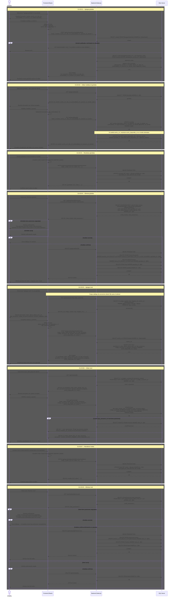

# Góndolas y Niveles

Cubre la gestión (agregar, editar, reordenar, eliminar) de góndolas y niveles dentro de una versión de planograma, incluyendo la asignación de accesorios a niveles.

```mermaid
sequenceDiagram
    actor Analista
    participant FE as Frontend (React)
    participant API as Backend (Node.js)
    participant DB as SQL Server

    %% ─── NOTA ──────────────────────────────────────────────────────────────────
    %% CU-03 no consume CATI. Tablas involucradas: Gondola, Nivel, Accesorio, Posicion.
    %% La tabla Accesorio (ganchos/bandejas/barras) vive en SQL Server.
    %% Reordenar opera sobre el campo `orden` (int) de Gondola y Nivel.
    %% ────────────────────────────────────────────────────────────────────────────

    %% ════════════════════════════════════════════════════════
    %% CU-03-01 — Agregar góndola
    %% ════════════════════════════════════════════════════════

    rect rgba(89, 89, 89, 1)
        Note over Analista,DB: CU-03-01 — Agregar góndola

        Analista->>FE: Selecciona "Agregar góndola" en la versión
        FE-->>Analista: Muestra formulario: nombre, ancho_cm, alto_cm,<br/>profundidad_cm, posicion_en_tienda (opcional)

        Analista->>FE: Completa medidas y confirma
        FE->>FE: Validación local<br/>· nombre requerido<br/>· ancho, alto, profundidad > 0

        FE->>API: POST /api/versiones/{versionId}/gondolas<br/>Body: { nombre, ancho_cm, alto_cm, profundidad_cm, posicion_en_tienda? }

        API->>DB: SELECT estado FROM PlanogramaVersion WHERE id = @versionId
        DB-->>API: estado

        alt Versión publicada o archivada (no editable)
            API-->>FE: 422 Unprocessable { error: "La versión no está en modo editable" }
            FE-->>Analista: Muestra error
        else
            API->>DB: SELECT COALESCE(MAX(orden), 0) + 1 AS siguiente_orden<br/>FROM Gondola WHERE planograma_version_id = @versionId
            DB-->>API: siguiente_orden

            API->>DB: INSERT INTO Gondola<br/>(planograma_version_id, nombre, ancho_cm, alto_cm,<br/>profundidad_cm, posicion_en_tienda, orden=siguiente_orden)
            DB-->>API: { id }
            API-->>FE: 201 Created<br/>{ id, versionId, nombre, ancho_cm, alto_cm,<br/>profundidad_cm, posicion_en_tienda, orden }
            FE-->>Analista: Renderiza nueva góndola vacía en el editor
        end
    end

    %% ════════════════════════════════════════════════════════
    %% CU-03-02 — Editar medidas de góndola
    %% ════════════════════════════════════════════════════════

    rect rgba(89, 89, 89, 1)
        Note over Analista,DB: CU-03-02 — Editar medidas de góndola

        Analista->>FE: Selecciona góndola y abre panel de edición
        FE->>API: GET /api/gondolas/{id}
        API->>DB: SELECT * FROM Gondola WHERE id = @id
        DB-->>API: gondola
        API-->>FE: 200 OK { id, nombre, ancho_cm, alto_cm, profundidad_cm, posicion_en_tienda, orden }
        FE-->>Analista: Muestra formulario con valores actuales

        Analista->>FE: Modifica medidas y guarda
        FE->>FE: Validación local (ancho, alto, profundidad > 0)

        FE->>API: PUT /api/gondolas/{id}<br/>Body: { nombre, ancho_cm, alto_cm, profundidad_cm, posicion_en_tienda }

        API->>DB: UPDATE Gondola<br/>SET nombre=@nombre, ancho_cm=@ancho_cm, alto_cm=@alto_cm,<br/>profundidad_cm=@profundidad_cm, posicion_en_tienda=@posicion_en_tienda<br/>WHERE id=@id
        DB-->>API: OK

        Note over API,DB: Si cambió ancho_cm, recalcular ancho_disponible_cm en niveles afectados
        API->>DB: UPDATE Nivel SET ancho_disponible_cm = @nuevo_ancho<br/>WHERE gondola_id = @id AND ancho_disponible_cm = @ancho_anterior
        DB-->>API: OK

        API-->>FE: 200 OK { id, nombre, ancho_cm, alto_cm, profundidad_cm, posicion_en_tienda }
        FE-->>Analista: Actualiza visualización del editor con nuevas medidas
    end

    %% ════════════════════════════════════════════════════════
    %% CU-03-03 — Reordenar góndolas
    %% ════════════════════════════════════════════════════════

    rect rgba(89, 89, 89, 1)
        Note over Analista,DB: CU-03-03 — Reordenar góndolas

        Analista->>FE: Arrastra góndola a nueva posición en la lista
        FE->>FE: Actualiza orden visual inmediatamente (optimistic update)

        FE->>API: PATCH /api/versiones/{versionId}/gondolas/reordenar<br/>Body: { orden: [{ id: int, orden: int }, ...] }

        API->>DB: BEGIN TRANSACTION
        API->>DB: UPDATE Gondola SET orden = @orden WHERE id = @id<br/>— ejecutado por cada elemento del arreglo
        API->>DB: COMMIT
        DB-->>API: OK

        API-->>FE: 200 OK { gondolas: [{ id, orden }, ...] }
        FE-->>Analista: Confirma nuevo orden en editor
    end

    %% ════════════════════════════════════════════════════════
    %% CU-03-04 — Eliminar góndola
    %% ════════════════════════════════════════════════════════

    rect rgba(89, 89, 89, 1)
        Note over Analista,DB: CU-03-04 — Eliminar góndola

        Analista->>FE: Selecciona "Eliminar góndola"

        FE->>API: GET /api/gondolas/{id}/resumen<br/>(consulta previa para mostrar confirmación)
        API->>DB: SELECT COUNT(DISTINCT n.id) AS total_niveles,<br/>COUNT(DISTINCT p.id) AS total_posiciones<br/>FROM Gondola g<br/>LEFT JOIN Nivel n ON n.gondola_id = g.id<br/>LEFT JOIN Posicion p ON p.nivel_id = n.id<br/>WHERE g.id = @id
        DB-->>API: { total_niveles, total_posiciones }
        API-->>FE: 200 OK { total_niveles, total_posiciones }

        alt Góndola tiene posiciones asignadas
            FE-->>Analista: Solicita confirmación:<br/>"Esta góndola tiene {N} niveles y {M} posiciones.<br/>¿Eliminar de todos modos? Esta acción no se puede deshacer."
        else Góndola vacía
            FE-->>Analista: Solicita confirmación simple
        end

        alt Analista cancela
            FE-->>Analista: Cierra diálogo sin cambios
        else Analista confirma
            FE->>API: DELETE /api/gondolas/{id}

            API->>DB: BEGIN TRANSACTION
            API->>DB: DELETE FROM PosicionAccesorio<br/>WHERE posicion_id IN (SELECT p.id FROM Posicion p JOIN Nivel n ON n.id = p.nivel_id WHERE n.gondola_id = @id)
            API->>DB: DELETE FROM Posicion<br/>WHERE nivel_id IN (SELECT id FROM Nivel WHERE gondola_id = @id)
            API->>DB: DELETE FROM Nivel WHERE gondola_id = @id
            API->>DB: DELETE FROM Gondola WHERE id = @id
            API->>DB: COMMIT
            DB-->>API: OK

            API-->>FE: 204 No Content
            FE-->>Analista: Elimina góndola del editor y reajusta orden visual
        end
    end

    %% ════════════════════════════════════════════════════════
    %% CU-03-05 — Agregar nivel
    %% ════════════════════════════════════════════════════════

    rect rgba(89, 89, 89, 1)
        Note over Analista,DB: CU-03-05 — Agregar nivel

        Analista->>FE: Selecciona "Agregar nivel" en una góndola

        Note over FE,DB: Carga catálogo de accesorios desde SQL para el selector
        FE->>API: GET /api/accesorios?tipo={tipo_opcional}
        API->>DB: SELECT id, codigo, nombre, tipo, longitud_cm, ancho_cm<br/>FROM Accesorio<br/>WHERE (@tipo IS NULL OR tipo = @tipo)<br/>ORDER BY tipo, nombre
        DB-->>API: accesorios[]
        API-->>FE: 200 OK [ { id, codigo, nombre, tipo, longitud_cm }, ... ]

        FE-->>Analista: Muestra formulario: orden, altura_desde_piso_cm,<br/>tipo_accesorio, codigo_accesorio (selector), tamano_pulgadas, notas

        Analista->>FE: Completa campos y confirma
        FE->>FE: Validación local<br/>· altura_desde_piso_cm requerida y > 0<br/>· tipo_accesorio requerido

        FE->>API: POST /api/gondolas/{gondolaId}/niveles<br/>Body: { orden, altura_desde_piso_cm, tipo_accesorio,<br/>codigo_accesorio_id?, tamano_accesorio_pulgadas?,<br/>ancho_disponible_cm, notas? }

        API->>DB: SELECT ancho_cm FROM Gondola WHERE id = @gondolaId
        DB-->>API: ancho_cm

        API->>DB: INSERT INTO Nivel<br/>(gondola_id, orden, altura_desde_piso_cm, tipo_accesorio,<br/>codigo_accesorio_id, tamano_accesorio_pulgadas,<br/>ancho_disponible_cm, notas)
        DB-->>API: { id }

        API-->>FE: 201 Created<br/>{ id, gondolaId, orden, altura_desde_piso_cm, tipo_accesorio,<br/>accesorio: { id, codigo, nombre }?, tamano_accesorio_pulgadas,<br/>ancho_disponible_cm, notas }
        FE-->>Analista: Renderiza nuevo nivel vacío en la góndola
    end

    %% ════════════════════════════════════════════════════════
    %% CU-03-06 — Editar nivel
    %% ════════════════════════════════════════════════════════

    rect rgba(89, 89, 89, 1)
        Note over Analista,DB: CU-03-06 — Editar nivel

        Analista->>FE: Selecciona nivel y abre panel de edición

        FE->>API: GET /api/niveles/{id}
        API->>DB: SELECT n.*, a.codigo, a.nombre AS accesorio_nombre<br/>FROM Nivel n LEFT JOIN Accesorio a ON a.id = n.codigo_accesorio_id<br/>WHERE n.id = @id
        DB-->>API: nivel + accesorio
        API-->>FE: 200 OK { id, gondolaId, orden, altura_desde_piso_cm,<br/>tipo_accesorio, accesorio?, tamano_accesorio_pulgadas,<br/>ancho_disponible_cm, notas }
        FE-->>Analista: Muestra formulario con valores actuales

        Analista->>FE: Modifica campos y guarda
        FE->>API: PUT /api/niveles/{id}<br/>Body: { altura_desde_piso_cm, tipo_accesorio,<br/>codigo_accesorio_id?, tamano_accesorio_pulgadas?,<br/>ancho_disponible_cm, notas? }

        API->>DB: UPDATE Nivel<br/>SET altura_desde_piso_cm=@altura, tipo_accesorio=@tipo,<br/>codigo_accesorio_id=@accId, tamano_accesorio_pulgadas=@tamano,<br/>ancho_disponible_cm=@ancho, notas=@notas<br/>WHERE id=@id
        DB-->>API: OK

        alt Cambió tipo_accesorio y el nivel tiene posiciones
            API->>DB: SELECT COUNT(*) FROM Posicion WHERE nivel_id = @id
            DB-->>API: countPosiciones
            API-->>FE: 200 OK { ...nivel, advertencia: "El tipo de accesorio cambió.<br/>Revisa unidades_por_facing en las posiciones existentes." }
        else
            API-->>FE: 200 OK { id, altura_desde_piso_cm, tipo_accesorio,<br/>accesorio?, tamano_accesorio_pulgadas, ancho_disponible_cm }
        end
        FE-->>Analista: Actualiza visualización del nivel en el editor
    end

    %% ════════════════════════════════════════════════════════
    %% CU-03-07 — Reordenar niveles
    %% ════════════════════════════════════════════════════════

    rect rgba(89, 89, 89, 1)
        Note over Analista,DB: CU-03-07 — Reordenar niveles

        Analista->>FE: Arrastra nivel a nueva posición vertical dentro de la góndola
        FE->>FE: Actualiza orden visual inmediatamente (optimistic update)

        FE->>API: PATCH /api/gondolas/{gondolaId}/niveles/reordenar<br/>Body: { orden: [{ id: int, orden: int }, ...] }

        API->>DB: BEGIN TRANSACTION
        API->>DB: UPDATE Nivel SET orden = @orden WHERE id = @id<br/>— ejecutado por cada elemento del arreglo
        API->>DB: COMMIT
        DB-->>API: OK

        API-->>FE: 200 OK { niveles: [{ id, orden }, ...] }
        FE-->>Analista: Confirma nuevo orden en editor
    end

    %% ════════════════════════════════════════════════════════
    %% CU-03-08 — Eliminar nivel
    %% ════════════════════════════════════════════════════════

    rect rgba(89, 89, 89, 1)
        Note over Analista,DB: CU-03-08 — Eliminar nivel

        Analista->>FE: Selecciona "Eliminar nivel"

        FE->>API: GET /api/niveles/{id}/resumen
        API->>DB: SELECT COUNT(p.id) AS total_posiciones<br/>FROM Nivel n LEFT JOIN Posicion p ON p.nivel_id = n.id<br/>WHERE n.id = @id
        DB-->>API: { total_posiciones }
        API-->>FE: 200 OK { total_posiciones }

        alt Nivel tiene posiciones asignadas
            FE-->>Analista: Solicita confirmación:<br/>"Este nivel tiene {N} posiciones asignadas.<br/>Muévelas o elimínalas antes de eliminar el nivel,<br/>o confirma para eliminarlas junto con el nivel."

            alt Analista cancela
                FE-->>Analista: Cierra diálogo — el analista mueve las posiciones manualmente
            else Analista confirma eliminación en cascada
                FE->>API: DELETE /api/niveles/{id}?forzar=true
                API->>DB: BEGIN TRANSACTION
                API->>DB: DELETE FROM PosicionAccesorio<br/>WHERE posicion_id IN (SELECT id FROM Posicion WHERE nivel_id = @id)
                API->>DB: DELETE FROM Posicion WHERE nivel_id = @id
                API->>DB: DELETE FROM Nivel WHERE id = @id
                API->>DB: COMMIT
                DB-->>API: OK
                API-->>FE: 204 No Content
                FE-->>Analista: Elimina nivel del editor
            end
        else Nivel vacío
            FE-->>Analista: Solicita confirmación simple

            alt Analista confirma
                FE->>API: DELETE /api/niveles/{id}
                API->>DB: DELETE FROM Nivel WHERE id = @id
                DB-->>API: OK
                API-->>FE: 204 No Content
                FE-->>Analista: Elimina nivel del editor
            end
        end
    end
```
