# Sustitución de SKUs

Cubre el flujo explícito de sustitución de un SKU en una o varias posiciones de una versión: inicio, búsqueda y selección del sustituto, confirmación con motivo obligatorio, y consulta del historial de sustituciones.

```mermaid
sequenceDiagram
    actor Analista
    participant FE as Frontend (React)
    participant API as Backend (Node.js)
    participant CATI as CATI (API.Catalogo)
    participant DB as SQL Server

    %% ─── NOTA ──────────────────────────────────────────────────────────────────
    %% La sustitución es un flujo explícito — distinto de editar el campo SKU.
    %% Genera registro en HistorialSustitucion con posiciones_afectadas (JSON).
    %% CATI se usa para: buscar SKU sustituto y obtener dimensiones del sustituto.
    %% Producto.sku_sustituto en SQL es la recomendación del catálogo (FK self).
    %%
    %% Auth CATI — dos saltos internos (el frontend nunca llama a CAO ni CATI):
    %%   Salto 1 — CAO: POST https://cemacoallinone.azurewebsites.net/api/auth
    %%             Body: { user, password } → { data: { token } }  (tokenCAO)
    %%   Salto 2 — CATI exchange: POST http://10.20.12.9:8881/api/Auth/exchange
    %%             Body: { tokenCemacoAllInOne: tokenCAO }
    %%             → { data: { accessToken, accessTokenExpiresAt,
    %%                         refreshToken, refreshTokenExpiresAt } }
    %%   Todas las llamadas a CATI envían ambas credenciales:
    %%     Authorization: Bearer {accessToken}  (JWT — para endpoints que lo requieren)
    %%     x-api-key: {CATI_API_KEY}            (para endpoints que lo requieren)
    %%   El tokenManager cachea el accessToken en memoria y lo refresca antes de expirar.
    %% ────────────────────────────────────────────────────────────────────────────

    %% ════════════════════════════════════════════════════════
    %% CU-05-01 — Iniciar sustitución de SKU
    %% ════════════════════════════════════════════════════════

    rect rgba(89, 89, 89, 1)
        Note over Analista,DB: CU-05-01 — Iniciar sustitución de SKU

        Analista->>FE: Selecciona una o varias posiciones con el SKU a sustituir<br/>y elige "Sustituir SKU"

        FE->>FE: Agrupa posiciones seleccionadas por SKU<br/>Valida que todas las posiciones seleccionadas compartan el mismo SKU<br/>(si hay múltiples SKUs seleccionados, muestra advertencia y filtra)

        FE->>API: GET /api/posiciones/por-sku?sku={sku}&versionId={versionId}
        API->>DB: SELECT p.id, p.orden_horizontal, n.id AS nivel_id,<br/>n.orden AS nivel_orden, g.nombre AS gondola_nombre<br/>FROM Posicion p<br/>JOIN Nivel n ON n.id = p.nivel_id<br/>JOIN Gondola g ON g.id = n.gondola_id<br/>WHERE p.sku = @sku<br/>AND g.planograma_version_id = @versionId<br/>ORDER BY g.nombre, n.orden, p.orden_horizontal
        DB-->>API: posiciones[]
        API-->>FE: 200 OK { sku, totalPosicionesEnVersion: N,<br/>posiciones: [{ id, gondola, nivel, orden_horizontal }] }

        Note over API,DB: Consulta si existe sustituto recomendado en catálogo SQL
        API->>DB: SELECT sku_sustituto FROM Producto WHERE sku = @sku
        DB-->>API: sku_sustituto (puede ser null)
        API-->>FE: 200 OK { ...posiciones, sku_sustituto_recomendado: "SKU-123" | null }

        FE-->>Analista: Muestra flujo de sustitución:<br/>posiciones afectadas (pre-seleccionadas o editables)<br/>+ sustituto recomendado si existe
    end

    %% ════════════════════════════════════════════════════════
    %% CU-05-02 — Seleccionar SKU sustituto
    %% ════════════════════════════════════════════════════════

    rect rgba(89, 89, 89, 1)
        Note over Analista,DB: CU-05-02 — Seleccionar SKU sustituto

        Analista->>FE: Busca el SKU sustituto en el buscador del flujo

        FE->>API: GET /api/catalog/productos/buscar<br/>Query: ?q={texto}&subcategoria={sub?}&page=1&pageSize=20
        API->>CATI: GET /api/Product/search?Sku={q}&Descripcion={q}&Marca={q}<br/>&Subcategoria={sub}&Profile=CEMACO&PageNumber=1&PageSize=20  [Bearer]
        CATI-->>API: { productos: [...] }
        API-->>FE: 200 OK [ { sku, nombre, marca, ancho_cm, alto_cm,<br/>profundidad_cm, imagen_url, precio }, ... ]
        FE-->>Analista: Muestra resultados resalta el sustituto recomendado si coincide

        Analista->>FE: Selecciona el SKU sustituto
        FE->>API: GET /api/catalog/productos/{skuSustituto}
        API->>CATI: GET /api/Product/{skuSustituto}?profile=CEMACO  [Bearer]
        CATI-->>API: Product { id, name, erpInformation, assets[], internalAttributes }
        API-->>FE: 200 OK { sku, nombre, ancho_cm, alto_cm, profundidad_cm, imagen_url }

        FE->>FE: Compara dimensiones original vs sustituto<br/>Si diferencia > 20% en ancho_cm → preparar advertencia

        FE-->>Analista: Muestra ficha del sustituto y avisa si hay diferencia significativa de tamaño:<br/>"El sustituto tiene X% más ancho — revisa los facings después de confirmar"
    end

    %% ════════════════════════════════════════════════════════
    %% CU-05-03 — Confirmar sustitución
    %% ════════════════════════════════════════════════════════

    rect rgba(89, 89, 89, 1)
        Note over Analista,DB: CU-05-03 — Confirmar sustitución

        Analista->>FE: Ingresa motivo de sustitución (obligatorio) y confirma

        FE->>FE: Validación local: motivo requerido, min. 10 chars

        FE->>API: POST /api/versiones/{versionId}/sustituciones<br/>Body: { sku_original, sku_sustituto, motivo,<br/>posicion_ids: [int, ...] }

        API->>API: Verifica token de sesión
        API->>DB: SELECT estado FROM PlanogramaVersion WHERE id = @versionId
        DB-->>API: estado

        alt Versión publicada o archivada
            API-->>FE: 422 Unprocessable { error: "La versión no está en modo editable" }
            FE-->>Analista: Muestra error
        else Editable
            Note over API,CATI: Obtiene dimensiones del sustituto para recalcular campos derivados
            API->>CATI: GET /api/Product/{skuSustituto}?profile=CEMACO  [Bearer]
            CATI-->>API: Product { erpInformation.ancho, erpInformation.alto, erpInformation.profundidad, assets[] }

            API->>DB: BEGIN TRANSACTION
            API->>DB: UPDATE Posicion SET sku = @skuSustituto<br/>WHERE id IN (@posicion_ids)
            DB-->>API: rowsAffected

            Note over API,DB: Recalcula ancho_asignado_cm por posición si el ancho cambió
            API->>DB: UPDATE Posicion<br/>SET ancho_asignado_cm = facings_horizontal × @nuevo_ancho_cm<br/>WHERE id IN (@posicion_ids)
            DB-->>API: OK

            API->>DB: INSERT INTO HistorialSustitucion<br/>(planograma_version_id, sku_original, sku_sustituto,<br/>motivo, fecha=NOW(), usuario_id,<br/>posiciones_afectadas=JSON_ARRAY(@posicion_ids))
            DB-->>API: { id: historialId }
            API->>DB: COMMIT
            DB-->>API: OK

            API-->>FE: 200 OK<br/>{ historialId, skuOriginal, skuSustituto, motivo,<br/>posicionesActualizadas: N,<br/>advertencias: ["Revisa facings — diferencia de tamaño > 20%"] | [] }
            FE-->>Analista: Muestra confirmación con posiciones actualizadas<br/>y advertencias de dimensiones si aplica
        end
    end

    %% ════════════════════════════════════════════════════════
    %% CU-05-04 — Consultar historial de sustituciones
    %% ════════════════════════════════════════════════════════

    rect rgba(89, 89, 89, 1)
        Note over Analista,DB: CU-05-04 — Consultar historial de sustituciones

        Analista->>FE: Selecciona "Ver historial de sustituciones" en la versión

        FE->>API: GET /api/versiones/{versionId}/sustituciones<br/>Query: ?page=1&pageSize=20

        API->>DB: SELECT hs.id, hs.sku_original, hs.sku_sustituto,<br/>hs.motivo, hs.fecha, hs.usuario_id,<br/>hs.posiciones_afectadas,<br/>p_orig.nombre AS nombre_original,<br/>p_sust.nombre AS nombre_sustituto<br/>FROM HistorialSustitucion hs<br/>LEFT JOIN Producto p_orig ON p_orig.sku = hs.sku_original<br/>LEFT JOIN Producto p_sust ON p_sust.sku = hs.sku_sustituto<br/>WHERE hs.planograma_version_id = @versionId<br/>ORDER BY hs.fecha DESC<br/>OFFSET @offset ROWS FETCH NEXT @pageSize ROWS ONLY
        DB-->>API: historial[], totalCount

        API-->>FE: 200 OK<br/>{ data: [{ id, skuOriginal, nombreOriginal,<br/>skuSustituto, nombreSustituto, motivo,<br/>fecha, usuarioId, posicionesAfectadas: [int] }],<br/>total, page, pageSize }

        FE-->>Analista: Renderiza listado de sustituciones con SKU original → sustituto,<br/>motivo, fecha, usuario y cantidad de posiciones afectadas
    end
```

